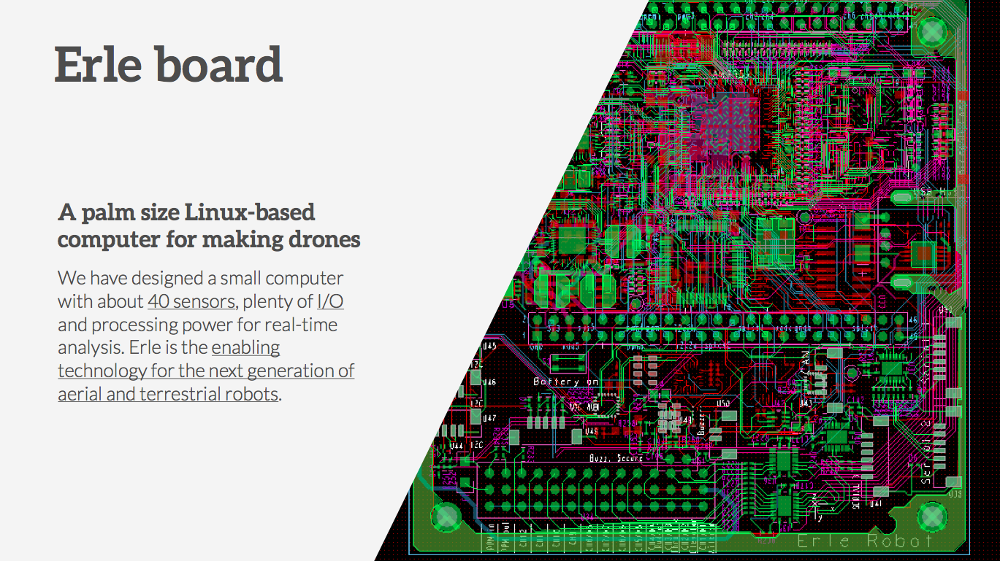

# Erle Robotics: Introduction to Networking in Linux

##Book

This book presents an introduction to **Network** in Linux, using [Erle board](http://erlerobot.com/). **Erle** is **a small-size Linux computer for making drones.**

Throught this tutorial you will learn the basics about networking, concepts such as host or DNS, the usual commands in Linux networking and their functions...

##About

For years we've been working in the robotics field, particularly with drones. We have passed through different Universities and research centers and in all these places we actually found that most of the **drones are black boxes** (check out our [60s pitch](https://www.youtube.com/watch?v=tKAqjyXaC18)). Not meant to be used for learning, research. The software they use is in most of the cases unknown, closed source or **not documented**. Given these conditions, how are we going to educate the next generations on this technologies? How do you get started programming drones if you don't have $1000+ budget? Which platform allows me to get started with drones without risking a hand?

We are coming up with an answer to all these questions, our technology: **Erle**.

Inspired by the BeagleBone development board, we have designed a small computer with about 36+ sensors, plenty of I/O and processing power for real-time analysis. Erle is the enabling technology for the next generation of aerial and terrestrial robots that will be used in cities solving tasks such as surveillance, enviromental monitoring or even providing aid at catastrophes.

Our small-size Linux computer is bringing robotics to the people and businesses.

##License

This book has been based on diferent Linux documentation avaliable on the internet:
-  [The Linux Network Administrator's Guide ](http://www.tldp.org/LDP/nag2/nag2.pdf), part of the project ["The Open Source Writers Guild (OSWG)"](http://www.oswg.org:8080/oswg)
- [Linux Network Configuration](http://www.yolinux.com/TUTORIALS/LinuxTutorialNetworking.html)
- [Configuración de la red en GNU/Linux)]( http://elara.site.ac.upc.edu/documentacion/LINUX%20-%20UD11%20-%20Configuracion%20de%20red%20en%20Linux.pdf)
- [Introducción a las Redes de Ordenadores](http://docencia.etsit.urjc.es/moodle/mod/folder/view.php?id=3043)
- [Introduction to Linux: A Hands on Guide by Machtelt Garrels](http://www.tldp.org/LDP/intro-linux/html/chap_10.html)
- [How stuff works](http://www.howstuffworks.com/index.htm)
- [About.com /linux](http://linux.about.com/)
- [Wikipedia](http://en.wikipedia.org/wiki/English_Wikipedia)

Unless specified, this content is licensed under the Creative Commons Attribution-NonComercial-Share Alike 3.0 Unported License. To view a copy of this license, visit http://creativecommons.org/licenses/by-sa/3.0/ or send a letter to Creative Commons, 171 Second Street, Suite 300, San Francisco, California, 94105, USA.

All derivative works are to be attributed to *Silvia Núñez Rivero* of **Erle Robotics S.L.**.

For any questions, concerns, or issues submit them to support [at] erlerobot.com.

