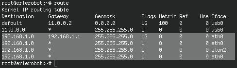

## Assigning an IP address

Computers may be assigned a static IP address or assigned one dynamically. Typically a server will require a static IP while a workstation will use DHCP (dynamic IP assignment). The Linux server requires a static IP so that those who wish to use its resources can find the system. It is more easily found if the IP address does not change and is static. This is not important for the Linux client workstation and thus it is easier to use an automated Dynamic Host Configuration Protocol (DHCP) for IP address assignment.

The sintaxis of the commadn used to assign a IP address is:
```
ifconfig interface [aftype] options | address ...
````

Static IP address assignment example:
```
 ifconfig eth0 192.168.1.5 netmask 255.255.255.0 up
```

The `ifconfig` command does NOT store this information permanently.Upon reboot this information is lost.

After setting up a Linux IP address with `ifconfig` command, use Linux `route` command to set up static routes to specific hosts or networks. Linux route command is a tool where you can setup where to send which data. Basically you can use route command to show and manipulate routing table. This is an example of how to use `route` command in Linux. Issue route command without any option will print current routing table.

To add a new IP route via eth0 (first Ethernet card), issue route add command in this format:
```
route add -net <ip> netmask <ip> dev eth0
```
```
root@erlerobot:~# route add -net 192.168.1.0 netmask 255.255.255.0 dev eth0
```
You can also add a gateway of the network:
```
route add -net <ip> gw <ip> netmask <ip> dev eth0
```
```
root@erlerobot:~# route add -net 192.168.1.0 gw 192.168.1.1 netmask 255.255.255.0 dev eth0
```
Now, check the routing table again:




We can see all configurations we made is in the result above.


