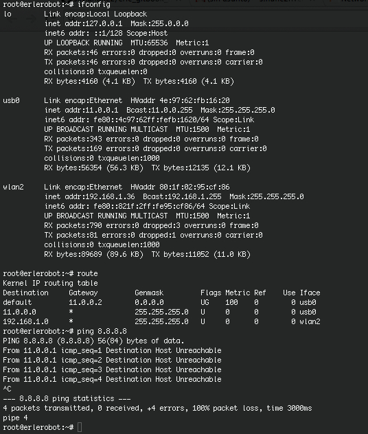
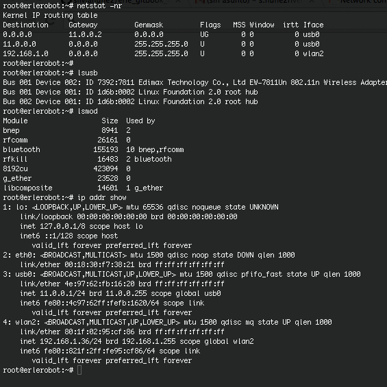

## Basic commands

This is a resume containing some of the most used comands when networking.

#####`ifconfig` command

This command lets you configure network interface parameters or assingn an address to a network.

#####`netstat` command

With this command you can list network connections, view routing table and gain information about network interface.Definitely,`netstat`show network status.

Also, `netstat -r`command is widely used to
show the routing tables.

##### `route` command

Linux `route` command manipulates the IP routing table. `route` is a utility used to manually manipulate the network routing.

#####` ping` command

Send ICMP ECHO_REQUEST packets to network hosts is what Linux `ping` command does.

#####`telnet` command

`telnet`command allows you to communicate with another host using the Telnet protocol. Probably telnet is one of those terms that most users are familiar with.If `telnet` is invoked without the host argument, it enters command mode, indicated by its prompt (``telnet>'').  In this mode, it accepts and executes the commands.

#####` ftp` command

This program allows users to transfer files to and from a remote network site using the Internet standard File Transfer Protocol.

####`arp`command

The arp utility displays and modifies the Internet-to-Ethernet address translation tables used by the address resolution protocol.

####`lsusb` command

 Is  a  utility for displaying information about USB buses in the system and the devices connected to them.

To make use of all the features of this program, you  need  to  have  a Linux  kernel  which  supports the /proc/bus/usb interface (e.g., Linux kernel 2.3.15 or newer).

####`lsmod` command

`lsmod` shows information about all loaded modules.
The format is name, size, use count, list of referring modules. The information displayed is identical to that available from /proc/modules.

#### `ip`command

IP is the transport layer protocol used by the Internet protocol family. Options may be set at the IP level when using higher-level protocols that are based on IP (such as TCP and UDP).  It may also be accessed through a``raw socket'' when developing new protocols, or special-purpose applica-tions.
With this command you can display the IP address or the Ip route.

####`traceroute`command
Displays the route packets take to network host.`traceroute` utilizes the IP protocol `time to live' field and attempts to elicit an ICMP TIME_EXCEEDED response from each gateway along the path to some host to determine the route one packet follows.

#### `whois`command

Specific domain name information can be queried using the `whois` command.This utility looks up records in the databases maintained by several Network Information Centers (NICs) and then displays internet domain name and network number directory service

####`sudo `command
This command allows a permitted user to execute a command as the superuser or another user, as specified in the sudoers file.

If the invoking user is root or if the target user is the same as the invoking user, no password is required.  Otherwise, sudo requires that users authenticate themselves with a password by default (NOTE: in the default configuration this is the user's password, not the root password).Once a user has been authenticated, a time stamp is updated and the user may then use sudo without a password for a short period of time (5 minutes unless overridden in sudoers).

|**Command**|**Meaning**|
|-------------|------------|
|ifconfig |configure network interface|
|netstat | show network status|
|route|manually manipulate the network routing|
|ping|send ICMP ECHO_REQUEST packets to network hosts|
|telnet|communicate with another host using the Telnet protocol|
|ftp|transfer files to and from a remote network site|
|arp|address resolution display and control|
|lsusb|displays info. about usb connections|
|lsmod| information about all loaded modules|
|ip -- show|display Ip address/route|
|traceroute|display packet's route|
|whois|domain name information|
|sudo |execute a command as another user|

Here you can find some examples of the execution of these commands:

