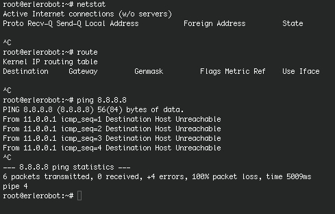

## Basic commands

This is a resume containing some of the most used comands when networking.

#####`ifconfig` command

This command lets you configure network interface parameters or assingn an address to a network.

#####`netstat` command

With this command you can list network connections, view routing table and gain information about network interface.Definitely,`netstat`show network status.

Also, `netstat -r`command is widely used to
show the routing tables.

##### `route` command

Linux `route` command manipulates the IP routing table. `route` is a utility used to manually manipulate the network routing.

#####` ping` command

Send ICMP ECHO_REQUEST packets to network hosts is what Linux `ping` command does.

#####`telnet` command

`telnet`command allows you to communicate with another host using the Telnet protocol. Probably telnet is one of those terms that most users are familiar with.If `telnet` is invoked without the host argument, it enters command mode, indicated by its prompt (``telnet>'').  In this mode, it accepts and executes the commands.

#####` ftp` command

This program allows users to transfer files to and from a remote network site using the Internet standard File Transfer Protocol.

####`arp`command

The arp utility displays and modifies the Internet-to-Ethernet address translation tables used by the address resolution protocol.

####`lsusb` command

 Is  a  utility for displaying information about USB buses in the system and the devices connected to them.

To make use of all the features of this program, you  need  to  have  a Linux  kernel  which  supports the /proc/bus/usb interface (e.g., Linux kernel 2.3.15 or newer).

####`lsmod` command

`lsmod` shows information about all loaded modules.
The format is name, size, use count, list of referring modules. The information displayed is identical to that available from /proc/modules.

|**Command**|**Meaning**|
|-------------|------------|
|ifconfig |configure network interface|
|netstat | show network status|
|route|manually manipulate the network routing|
|ping|send ICMP ECHO_REQUEST packets to network hosts|
|telnet|communicate with another host using the Telnet protocol|
|ftp|transfer files to and from a remote network site|
|arp|address resolution display and control|
|lsusb|displays info. about usb connections|
|lsmod| information about all loaded modules|

Here you can find some examples of the execution of these commands:

