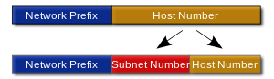
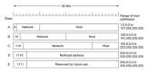

## Basic concepts

One of the first thing you should learn about networking is **IP protocol** and **IP addresses**.

IP protocol is one of the protocols that make a networking possible. Remember that a protocol is a rules that govern communication between two systems.
IP is a protocol at  *Network Level* that follows a pattern:

- *not oriented to connection*: whenever there is data to send, a message is send to the destination without  establishment phases.

- *datagram-based*: each message to a destination
routed separately. The unit of data that is send by IP is called IP datagram.

- *untrusted*: messages may be lost, get duplicates,
arrive out of order.

When talking about IP protocol, you should know the next subject which is IP address. IP address is a unique address assigned to one network computer. This is important because a network computer must know which computer it is communicating with such as in client talking to a server situation.Threrefore an IP address is assigned to each physic machine connected to the Internet.

IP addresses have 32 bytes and are divides into two parts:

- network identifier/network prefix: set of bytes that identify the network the machine is connected to.
- machine identifier/host prefix:unique set of bytes for each machine inside a network.

*Example:*

IP address: 212.128.4.4

|**Network identifier**|** Machine identifier**|
|----------------------|-----------------------|
| 212.128.4|4|

IP address is divided into five classes.Only the three first classes are assigned to machines (class A, class B and class C).
In each class the range and the size of the identifiers is different:

Next is **subnet mask**. Every time we assign an IP address to a network computer, we must also assign a subnet mask. Ip address comes with different subnet mask depending on it's class. In each IP classes, the subnet mask defines network segment of that system. It says how much of the address is used for the network is defined by the subnet mask.Definitely, the subnet mask is used to specify the networks and the sub-networks used.

Default subnet mask:

A-255.0.0.0

B-255.255.0.0

C-255.255.255.0

Related to networking and net-masks is the concept of the **gateaway**:It's an IP address that defines the junction between the locas network and the external network.In other words,a gateway is a host that is connected to two or more physical networks
simultaneously and is configured to switch packets between them
While the gateway IP address is a part of the local network such as the public Internet. The gateway IP address is normally configures in the routing table for the local system, as defined by the route or `netstat -r `command.

