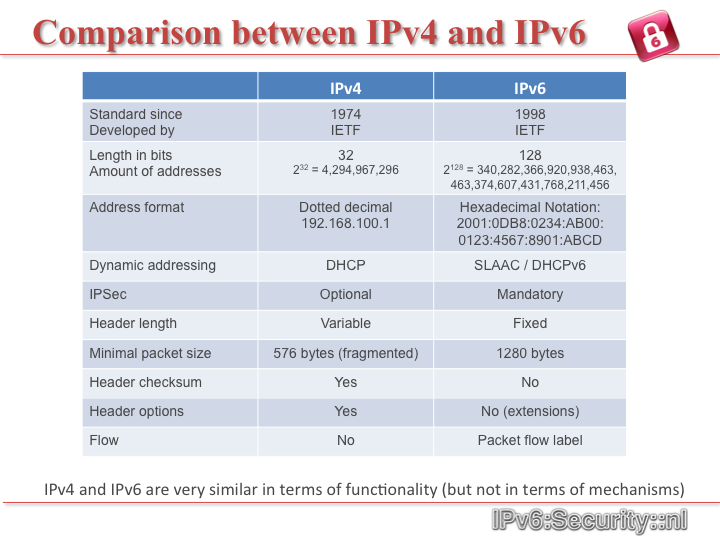

## IPv4 vs IPv6

As we have seen, at first glance, an IP address is like a phone number or a street address. When you connect to the Internet, your device (computer, cell phone, tablet) is assigned with an IP address, as well as each site you visit has an IP address.

The addressing system that we have used since the Internet was born is called IPv4, and the new addressing scheme is called IPv6.

It is important to define the difference between this two addressing systems.

####IPv4 address

To understand that the IPv4 address space is limited to 4.3 billion addresses, we can decompose an IPv4 address. An IPv4 address is a 32-bit number consisting of four octets (8-bit numbers) in a decimal notation, separated by periods. The bit can be either a 1 and a 0 (two possibilities), therefore the decimal notation would octet 2 raised to the 8th power of various options (256 of them, to be exact). Since we start counting from 0, the possible valuesof a byte in an IP address range from 0 to 255.

Examples of IPv4 addresses: 192.168.0.1, 66.228.118.51, 173.194.33.16

If an IPv4 address is made up of four sections with 256 possibilities in each section, to find the total number of IPv4 addresses, you should just multiply 256 * 256 * 256 * 256 to find results 4,294,967,296 addresses. To put it another way, we have 32 bits then 2 to the 32nd power will give the same result obtained.

####IPv6 address

IPv6 was designed to support the growth of Internet in the future generations. As mentioned earlier, each device that connects to the Internet using an IP address that needs to be unique. Other existing or developing solutions consider the "share" the same IP address between different devices, which leads to complicated networks become fragile and at the same time are difficult to analyze to correct problems.

The minimum allocation unit is IPv6, CIDR notation using a / 64. This implies that each device connected to the Internet using IPv6 has available 2 to the 64th power (18,446,744,073,709,551,616) IP addresses.

IPv6 addresses are 128 bits based. Using the same math above, we have 2 to the 128th power to find the total of total IPv6 address, same as mentioned above. Since space in IPv6 is much more extensive than the IPv4 would be very difficult to define space with decimal notation ... would have 2 raised to the 32nd power in each section.

To allow the use of such a large number of IPv6 addresses easier, IPv6 is composed of eight 16-bit sections, separated by a colon (:). Since each section is 16 bits, there are 2 raised to the 16 variations (which are 65,536 different possibilities). Using decimal numbers 0 through 65,535, would have represented a rather long address, and to facilitate it is that IPv6 addresses are expressed in hexadecimal notation (16 different characters 0-9 and af).

Example of an IPv6 address: 2607: f0d0: 4545: 3: 200: f8ff: FE21: 67CF

which remains a long term but is more manageable to do with decimal alternatives.

