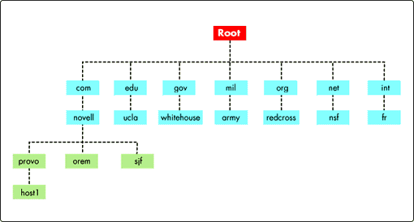

## What is *DNS*?


Domain Name System or DNS  is a hierarchical naming system for computers, services, or any resource connected to the Internet or a private network. This system associates various information with domain names assigned to each of the participants. Its most important function is to translate (resolve) intelligible names for people in binary identifiers associated with the devices connected to the network, all this in order to locating and addressing these devices worldwide.

The DNS server uses a distributed, hierarchical database that stores information associated with domain names in Internet networks. Although as the DNS database is able to associate different types of information on each name, the most common uses are mapping domain names to IP addresses and the location of the mail servers in each domain.

####Hierarchy of domains

- Root domain or domain `\.:

  + managed by ICANN (Internet Corporation for Assigned Names and Numbers).

  + The servers are root nameservers.

- First level domains (TLDs, Top Level Domains):
 + Generic tradicional domains:
```
com, edu, gov, mil, org, net, int
```
 + Generic modern domains:
 ```
aero, biz, coop, info, museum, name, pro, jobs,
mobi, tel, travel, cat, asia
```
 + Domain for the DNS infrastructure:
```
arpa
```
 + Domains by ISO country code:
```
uk, mx, ar, de, es, jp. . .
```
- Second, third ... level domains.


