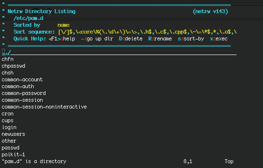
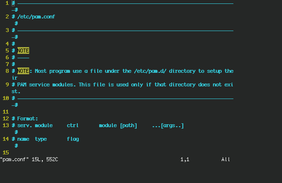

## Authentication services

Traditional

Traditionally, users are authenticated locally, using the information stored in /etc/passwd and /etc/shadow on each system. But even when using a network service for authenticating, the local files will always be present to configure system accounts for administrative use, such as the root account, the daemon accounts and often accounts for additional programs and purposes.

These files are often the first candidates for being examined by hackers, so make sure the permissions and ownerships are strictly set as should be:

```
root@erlerobot:~#  ls -l /etc/passwd /etc/shadow
```
```
-rw-r--r-- 1 root root   1256 May 22  2014 /etc/passwd
-rw-r----- 1 root shadow  800 May 22  2014 /etc/shadow
```

####PAM

Linux can use PAM, the Pluggable Authentication Module, a flexible method of UNIX authentication. Advantages of PAM:

A common authentication scheme that can be used with a wide variety of applications.

PAM can be implemented with various applications without having to recompile the applications to specifically support PAM.

Great flexibility and control over authentication for the administrator and application developer.

Application developers do not need to develop their program to use a particular authentication scheme. Instead, they can focus purely on the details of their program.

The directory /etc/pam.d contains the PAM configuration files (used to be /etc/pam.conf). Each application or service has its own file. You can edit o show the content of this files by typing:
```
vi pam.d
```


```
vi pam.conf
```


Each line in the file has four elements:

**Module**:

- auth: provides the actual authentication (perhaps asking for and checking a password) and sets credentials, such as group membership or Kerberos tickets.

- account: checks to make sure that access is allowed for the user (the account has not expired, the user is allowed to log in at this time of day, and so on).

- password: used to set passwords.

- session: used after a user has been authenticated. This module performs additional tasks which are needed to allow access (for example, mounting the user's home directory or making their mailbox available).

The order in which modules are stacked, so that multiple modules can be used, is very important.

- Control Flags: tell PAM which actions to take upon failure or success. Values can be required, requisite, sufficient or optional.

- Module Path: path to the pluggable module to be used, usually in /lib/security.

- Arguments: information for the modules.

Shadow password files are automatically detected by PAM.

More information can be found in the pam man pages or at the [Linux-PAM project](http://www.linux-pam.org/) homepage.

####LDAP

The Lightweight Directory Access Protocol is a client-server system for accessing global or local directory services over a network. On Linux, the OpenLDAP implementation is used. It includes slapd, a stand-alone server; slurpd, a stand-alone LDAP replication server; libraries implementing the LDAP protocol and a series of utilities, tools and sample clients.

LDAP directory service is based on a client-server model. One or more LDAP servers contain the data making up the LDAP directory tree or LDAP backend database. An LDAP client connects to an LDAP server and asks it a question. The server responds with the answer, or with a pointer to where the client can get more information (typically, another LDAP server). No matter what LDAP server a client connects to, it sees the same view of the directory; a name presented to one LDAP server references the same entry it would at another LDAP server. This is an important feature of a global directory service, like LDAP.


The main benefit of using LDAP is the consolidation of certain types of information within your organization. For example, all of the different lists of users within your organization can be merged into one LDAP directory. This directory can be queried by any LDAP-enabled applications that need this information. It can also be accessed by users who need directory information.


Since LDAP is an open and configurable protocol, it can be used to store almost any type of information relating to a particular organizational structure. Common examples are mail address lookups, central authentication in combination with PAM, telephone directories and machine configuration databases.

See your system specific information and the man pages for related commands such as `ldapmodify` (LDAP modify entry and LDAP add entry tools) and `ldapsearch`(LDAP search tool) for details.

- More information can be found in the [LDAP Linux HOWTO](http://www.tldp.org/HOWTO/LDAP-HOWTO/whatisldap.html), in ths webpage you will also find installing and configuting steps.

- Also this [website](http://www.linux.com/learn/tutorials/376144-manage-ldap-from-the-command-line) should be insteresting, for managing the LDAP from the command line.


