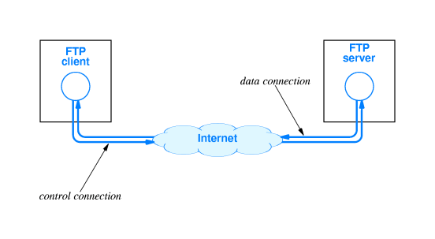

## FTP

FTP (File Transfer Protocol) is used to transfer files between two computers over a network and Internet.
FTP can transfer files between any computers that have an Internet connection, and also works between computers using totally different operating systems.

FTP requires a client (FTP program) installed on your PC to connect to your host, or server. Once you are logged in, you are presented with a directory. If files already exist on your host you can select the download to option and pull files off the FTP server to a specified directory on your computer. If you select the upload option, you must also select your PC directory that contains the files you wish to upload. The files are then copied from one location to the other. It's like copying files from one directory or folder on your PC, except that one of the folders could be on the East coast and the other folder on the West cost.

Transferring files from a client computer to a server computer is called "uploading" and transferring from a server to a client is "downloading".

#### FTP servers

On a Linux system, an FTP server is typically run from xinetd, using the WU-ftpd server, although the FTP server may be configured as a stand-alone server on systems with heavy FTP traffic. See the exercises.

Other FTP servers include among others vsftpd, Ncftpd and Proftpd.

Most Linux distributions contain the anonftp package, which sets up an anonymous FTP server tree and accompanying configuration files.

####FTP clients

Most Linux distributions include ncftp, an improved version of the common UNIX `ftp command, which you may also know from the Windows command line. The ncftp program offers extra features such as a nicer and more comprehensible user interface, file name completion, append and resume functions, bookmarking, session management and more.

>*Warning	FTP is insecure!*

Don't use the File Transfer Protocol for non-anonymous login unless you know what you are doing. Your user name and password might be captured by malevolent fellow network users. Use secure FTP instead; the sftp program comes with the Secure SHell suite, see Section

**To install and configure ftp in your Linux pc visit:**
https://help.ubuntu.com/10.04/serverguide/ftp-server.html

