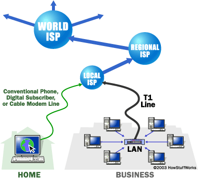
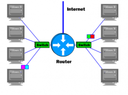

## Internet basics

So what is "the Internet"? The Internet is a gigantic collection of millions of computers, all linked together on a computer network.

One of the greatest things about the Internet is that nobody really owns it. It is a global collection of networks, both big and small. These networks connect together in many different ways to form the single entity that we know as the Internet. In fact, the very name comes from this idea of interconnected networks.

The network allows all of the computers to communicate with one another. A home computer may be linked to the Internet using a phone-line modem, DSL or cable modem that talks to an **Internet service provider (ISP)**. A computer in a business or university will usually have a **network interface card (NIC)** that directly connects it to a **local area network (LAN)** inside the business. The business can then connect its LAN to an ISP using a high-speed phone line like a **T1 line**. A T1 line can handle approximately 1.5 million bits per second, while a normal phone line using a modem can typically handle 30,000 to 50,000 bits per second. ISPs then connect to larger ISPs, and the largest ISPs maintain fiber-optic "backbones" for an entire nation or region. **Backbones** are typically fiber optic trunk lines. The trunk line has multiple fiber optic cables combined together to increase the capacity.Backbones around the world are connected through fiber-optic lines, undersea cables or satellite links (see An Atlas of Cyberspaces for some interesting backbone maps). In this way, every computer on the Internet is connected to every other computer on the Internet.

####The Function of an Internet Router

All the Internet networks rely on NAPs, backbones and routers to talk to each other.

A **router** is a device that forwards data packets between computer networks.The routers determine where to send information from one computer to another. Routers are specialized computers that send your messages and those of every other Internet user speeding to their destinations along thousands of pathways. A router has two separate, but related, jobs:

- It ensures that information doesn't go where it's not needed. This is crucial for keeping large volumes of data from clogging the connections of "innocent bystanders."
- It makes sure that information does make it to the intended destination.

In performing these two jobs,a router is extremely useful in dealing with two separate computer networks. It joins the two networks, passing information from one to the other. It also protects the networks from one another, preventing the traffic on one from unnecessarily spilling over to the other. Regardless of how many networks are attached, the basic operation and function of the router remains the same. Since the Internet is one huge network made up of tens of thousands of smaller networks, its use of routers is an absolute necessity.

####Clients and servers

In general, all of the machines on the Internet can be categorized as two types: servers and clients. Those machines that provide services (like Web servers or FTP servers) to other machines are **servers**. And the machines that are used to connect to those services are **clients**.

A server machine may provide one or more services on the Internet. For example, a server machine might have software running on it that allows it to act as a Web server, an e-mail server and an FTP server. Clients that come to a server machine do so with a specific intent, so clients direct their requests to a specific software server running on the overall server machine. For example, if you are running a Web browser on your machine, it will most likely want to talk to the Web server on the server machine. Your Telnet application will want to talk to the Telnet server, your e-mail application will talk to the e-mail server, and so on...

####URL: Uniform Resource Locator

When you use the Web or send an e-mail message, you use a domain name to do it. For example, the Uniform Resource Locator (URL) "http://www.erlerobot.com" contains the domain name erlerobot.com. So does this e-mail address: example@erlerobot.com. Every time you use a domain name, you use the Internet's DNS servers to translate the human-readable domain name into the machine-readable IP address.

Top-level domain names, also called first-level domain names, include .COM, .ORG, .NET, .EDU and .GOV. Within every top-level domain there is a huge list of second-level domains. For example, in the .COM first-level domain there is: Yahoo and Microsoft.
Every name in the .COM top-level domain must be unique. The left-most word, like www, is the host name. It specifies the name of a specific machine (with a specific IP address) in a domain. A given domain can, potentially, contain millions of host names as long as they are all unique within that domain.

####Ports and HTTP

Any server machine makes its services available using numbered ports(one for each service that is available on the server). For example, if a server machine is running a Web server and a file transfer protocol (FTP) server, the Web server would typically be available on port 80, and the FTP server would be available on port 21. Clients connect to a service at a specific IP address and on a specific port number.
Once a client has connected to a service on a particular port, it accesses the service using a specific protocol. Protocols are often text and simply describe how the client and server will have their conversation. Every Web server on the Internet conforms to the **hypertext transfer protocol (HTTP)**.

HTTP is an application protocol for distributed, collaborative, hypermedia information systems.
Hypertext is structured text that uses logical links (hyperlinks) between nodes containing text. HTTP is the protocol to exchange or transfer hypertext.

####Cookies

 A cookie is a piece of text that a Web server can store on a user's hard disk. Cookies allow a Web site to store information on a user's machine and later retrieve it. The pieces of information are stored as name-value pairs.

Cookies evolved because they solve a big problem for the people who implement Web sites. In the broadest sense, a cookie allows a site to store state information on your machine. This information lets a Web site remember what state your browser is in. An ID is one simple piece of state information; if an ID exists on your machine, the site knows that you have visited before. The state is, "Your browser has visited the site at least one time," and the site knows your ID from that visit.

####The World Wide Web (WWW)

The Internet has much to offer in terms of information on almost any subject matter imaginable and interaction with people and organizations from all over the world. Much of this access and interaction make use of the environment which is popularly known as the World Wide Web (WWW) or web. The WWW is an interlinked network of systems( web servers) offering multimedia services and information. A user can access these using what is known as web browser software, such as Mozilla  or Chrome web browsers.

