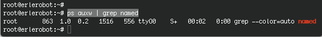
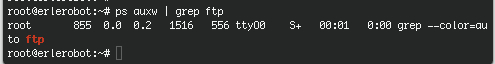

## Server types


####Standalone server

Offering a service to users can be approached in two ways. A daemon or service can run in standalone mode, or it can be dependent on another service to be activated.

Network services that are heavily and/or continuously used, usually run in the standalone mode: they are independent program daemons that are always running. They are most likely started up at system boot time, and they wait for requests on the specific connection points or ports for which they are set up to listen. When a request comes, it is processed, and the listening continues until the next request. A web server is a typical example: you want it to be available 24 hours a day, and if it is too busy it should create more listening instances to serve simultaneous users.

An example of a standalone network service on your home computer might be the named (name daemon), a caching name server. Standalone services have their own processes running, you can check any time using `ps`:
```
root@erlerobot:~# ps auxw | grep named
```


However, there are some services that you can use on your PC, even if there is no server process running for that services. Examples could be the FTP service, the secure copy service or the finger service. Those services have the Internet Daemon (inetd) listening in their place.

####(x)inetd

On your home PC, things are usually a bit calmer. You may have a small network, for instance, and you may have to transfer files from one PC to another from time to time, using FTP or Samba. In those cases, starting all the services which you only need occasionally and having them run all the time would be a waste of resources. So in smaller setups, you will find the necessary daemons dependent on a central program, that listen on all the ports of the services for which it is responsible.

This super-server, the Internet services daemon, is started up at system initialization time. There are two common implementations: inetd and xinetd (the extended Internet services daemon). One or the other is usually running on every Linux system:

```
ps -ef | grep inet
```


The services for which the Internet daemon is responsible, are listed in its configuration file, /etc/inetd.conf, for inetd, and in the directory /etc/xinetd.d for xinetd. Commonly managed services include file share and print services, SSH, FTP, telnet, the Samba configuration daemon, talk and time services.

As soon as a connection request is received, the central server will start an instance of the required server. Thus, in the example below, when user bob starts an FTP session to the local host, an FTP daemon is running as long as the session is active:

```
ps auxw | grep ftp
```


Of course, the same happens when you open connections to remote hosts: either a daemon answers directly, or a remote (x)inetd starts the service you need and stops it when you quit.


