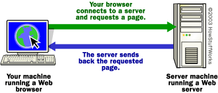

## Servers

A server is a system (software and suitable computer hardware) that responds to requests across a computer network to provide, or help to provide, a network service. Servers can be run on a dedicated computer, which is also often referred to as "the server", but many networked computers are capable of hosting servers. In many cases, a computer can provide several services and have several servers running.

If you want to get into a bit more detail on the process of getting a Web page onto your computer screen, here are the basic steps that occurred behind the scenes:

The browser broke the URL into three parts:

- The protocol ("http")
- The server name ("www.erlerobot.com")
- The file name ("tutorials.htm")

The browser communicated with a name server to translate the server name "www.erlerobot.com" into an IP Address, which it uses to connect to the server machine. The browser then formed a connection to the server at that IP address on port 80.
Following the HTTP protocol, the browser sent a GET request to the server, asking for the file "http://www.erlerobot.com/tutorials.htm".

The server then sent the HTML text for the Web page to the browser. (Cookies may also be sent from server to browser in the header for the page.) The browser read the HTML tags and formatted the page onto your screen.
