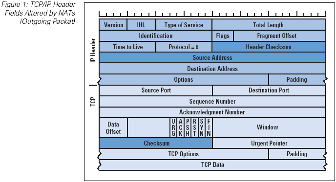

## TCP and packets

Modern networking applications require a sophisticated approach to carrying data from one machine to another.The solution that Unix systems, and subsequently many non−Unix systems, have adopted is known as TCP/IP.

The **Transport Control Protocol (TCP)** and the **Internet Protocol (IP)** are the two most popular ways of communicating on the Internet. A lot of applications, such as your browser and E-mail program, are built on top of this protocol suite.

When talking about TCP/IP networks you will hear the term datagram, which technically has a special meaning but is often used interchangeably with packet.
Very simply put, IP provides a solution for sending packets of information from one machine to another, while TCP ensures that the packets are arranged in streams, so that packets from different applications don't get mixed up, and that the packets are sent and received in the correct order.

Here is a description of what a packet actually looks like.The start of each packet says where it's going, where it came from, the type of the packet, and other administrative details. This part is called the 'packet header'. The rest of the packet, containing the actual data being transmitted, is usually called the 'packet body'.

- So any IP packet begins with an 'IP header': at least 20 bytes long.
- If the protocol fields says this is a TCP packet, then a TCP header will immediately follow this IP header: the TCP header is also at least 20 bytes long.

If you want to know more about TPC/IP protocols and the packets, you can visit this [link](http://en.wikipedia.org/wiki/Transmission_Control_Protocol).
