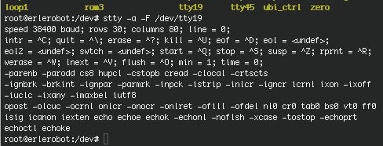

##  Accessing Serial Devices


Like all devices in a Unix system, serial ports are accessed through device special files, located in the /dev directory.
Type this to list the content of dev directory:
```
cd /dev
ls
```
There are two varieties of device files related to serial drivers, and there is one device file of each type for each port. The device will behave slightly differently, depending on which of its device files we open. We'll cover the differences because it will help you understand some of the configurations and advice that you might see relating to serial devices, but in practice you need to use only one of these.


The most important of the two classes of serial device has a major number of 4, and its device special files are named **ttyS0** , **ttyS1** , etc. The second variety has a major number of 5, and was designed for use when dialing out (calling out) through a port; its device special files are called **cua0** , **cua1** , etc. In the Unix world, counting generally starts at zero, while laypeople tend to start at one. This creates a small amount of confusion for people because COM1: is represented by /dev/ttyS0 , COM2: by /dev/ttyS1 , etc.

The cua , or "callout," devices were created to solve the problem of avoiding conflicts on serial devices for modems that have to support both incoming and outgoing connections. Unfortunately, they've created their own problems and are now likely to be discontinued.

When dealing with devices `stty`command is very useful.The `stty` utility sets or reports on terminal characteristics for the device that is its standard input.  If no options or operands are specified, it reports the settings of a subset of characteristics as well as additional ones if they differ from their default values.  Otherwise it modifies the terminal state according to the specified arguments.  Some
combinations of arguments are mutually exclusive on some terminal types.

`stty command can be used to display the terminal configuration parameters of a tty
device. To display all of the active settings on a tty device, use:
```
stty −a −F /dev/ttyS1
```



