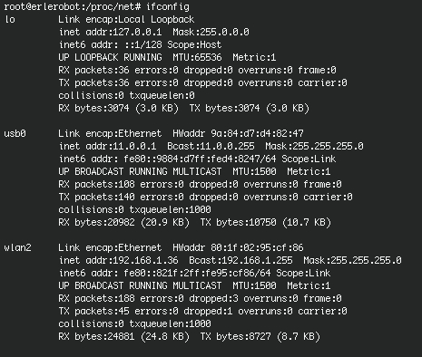
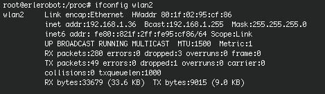
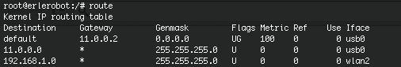
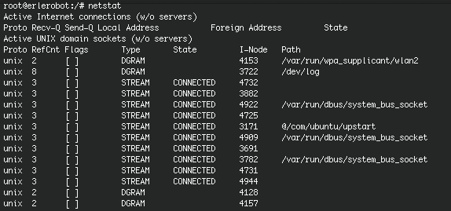
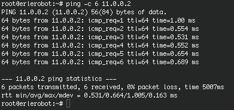

## Network configuration commands


#### Ifconfig

There are many more parameters to `ifconfig` than we have described so far. Its normal invocation is this:
```
ifconfig interface [address [parameters]]
```
interface is the interface name, and address is the IP address to be assigned to the interface. This may
be either an IP address in dotted quad notation or a name that `ifconfig` will look up in /etc/hosts.

```
ifconfig
```
As we have seen this command displays the configuration information for all network interfaces of the system.



```
ifconfig eth0 down
```
Disables the network interface eth0.

```
ifconfig eth0
```
Check the status of the eth0 interface.



```
ifconfig interfase dirección-ip
```

Interfacing basic configuration.Asign IP address and activates it. The other parameters take values assigned by default.For example, the subnet mask takes the value corresponding to the type of network the Ip address belong to.Like that we have  255.255.0.0 for a vlass B address.

```
ifconfig eth0 100.200.26.1 netmask 255.255.255.0 broadcast 100.200.26.255
```
Sets the network interface from scratch.

In this [link](http://www.tldp.org/LDP/nag/node73.html) you can find other option when working with ifconfig.

####route

The sintaxis is the following one:
```
route  [-n] command [-net|-host] destination
```


In the sintaxis above, destination is the destination host or network, gateway is the next-hop intermediary via which packets should be routed.  Routes to a particular host may be distinguished from those to a network by inter- preting the Internet address specified as the destination argument.  The optional modifiers -net and -host force the destination to be interpreted as a network or a host, respectively.

The  `route`command  itselfs display the IP routing table of the system. Also allows to add or remove an entry in the routing table. This command allows you to set static routes when network routing.




```
option -net
```
Specifies that the specified target is a network.
```
option -host
```
Specifies that the specified target is a computer.


```
route -n
```

Prints the routing table full core if run without arguments (the-n option makes use dotted quad instead of hostnames).

```
route add –net 192.168.1.0 gw 192.168.1.2
```

Add a route to a network through a gateway.

```
route add- host 192.168.1.250 dev eth0
```
Adds a route to an
particular machine via a local interfacing.
```
route add domain
```
Adds a route to the routing table using
the names defined in the file /etc /networks. Thus
prevents write-net indicator because route knows that this is network


```
route add default gw host
```

Routing through the default gateway.

####netstat

Depending on the selected option `netstat`command shows the networks interfaces, the PID associated to each interface...



```
netstat -c
```
Renews the information continually till you push `^C`(ctrl + c).
```
netstat -i
```
Displays a list with all the network interfaces.
```
netstat -p
```
Shows a list with all the PID.
```
netstat -r
```
Displays the information of the routing table.
```
netstat -t
```
Shows the active connections of the TCP ports Muestra las conexiones activas a puertos TCP.
```
netstat -u
```
Displays active connections to UDP ports. If included "a" will also display the ports that are waiting for a connection (listening).


####ping

The sintaxis is the following one:
```
ping hostname
```
The ping command sends an ICMP echo request protocol to the specified hostname and shows the time to
receive confirmation echo. The default sends
messages indefinitely until the order is canceled by
`^C`.

```
ping -c n hostname
```
 n messages will be sent. Al finalizar los mensajes
especificados se muestra la estadística de los resultados.After sending the specified messages, statistical results are shown.



