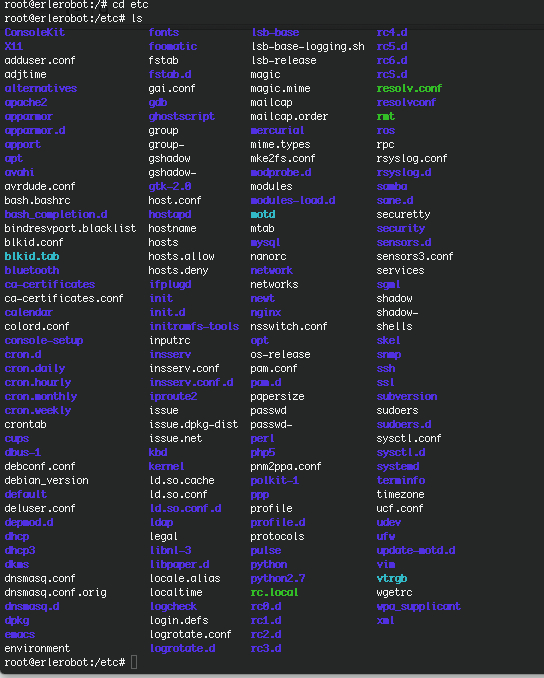
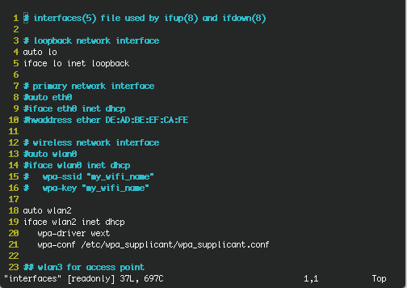

## Network configuration files

In Linux we are able to configure the network by editing the configuration files.We can find this files in the etc directory and edit them using, for example *vi* text editor.



#### /etc/network/interfaces

Contains information required to configure the interfaces of host network at boot time. It also allows you to set static routes to other networks.

What you find if you go to networks directory and open interfaces, by typing:
```
vi interfaces
```
Is text editable file like this:




####/etc/hostname
Here is specified the name of the machine.

####/etc/hosts

As we have seen in [*5.1 Host Basics*](../host/host_basics.md), in the file /etc/hosts specify the IP along with the name of each machine you want to access by name.

####/etc/resolv.conf

In the file / etc / resolv.conf specify what servers use to resolve domain names.
