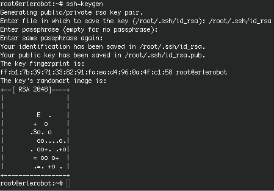

# SSH suite

SSH ( Secure SHell) is a protocol which facilitates secure communications between two systems using a client / server architecture that allows users to connect to a remote host.

Most UNIX and Linux systems now run Secure SHell in order to leave out the security risks that came with Telnet. Most Linux systems will run a version of OpenSSH, an Open Source implementation of the SSH protocol, providing secure encrypted communications between untrusted hosts over an untrusted network. In the standard setup X connections are automatically forwarded, but arbitrary TCP/IP ports may also be forwarded using a secure channel.

The SSH client connects and logs into the specified host name. The user must provide his identity to the remote machine as specified in the sshd_config file, which can usually be found in /etc/ssh. The configuration file is rather self-explanatory and by defaults enables most common features. Should you need help, you can find it in the sshd man pages.

When the user's identity has been accepted by the server, the server either executes the given command, or logs into the machine and gives the user a normal shell on the remote machine. All communication with the remote command or shell will be automatically encrypted.

The session terminates when the command or shell on the remote machine exits and all X11 and TCP/IP connections have been closed.

When connecting to a host for the first time, using any of the programs that are included in the SSH collection, you need to establish the authenticity of that host and acknowledge that you want to connect:


```
ssh 11.0.0.2
```

If you just want to check something on a remote machine and then get your prompt back on the local host, you can give the commands that you want to execute remotely as arguments to ssh:


```
ssh 11.0.0.2 who
```
```
root@erlerobot:~# ssh 11.0.0.2 who
ssh: connect to host 11.0.0.2 port 22: No route to host
```

The command `uname` prints operating system name:
```
root@erlerobot:~# uname -n
erlerobot
```

####X11 and TCP forwarding

X11 forwarding is when you use SSH to forward X windows to your local machine.  If the X11 Forwarding entry is set to yes on the target machine and the user is using X applications, the DISPLAY environment variable is set, the connection to the X11 display is automatically forwarded to the remote side in such a way that any X11 programs started from the shell will go through the encrypted channel, and the connection to the real X server will be made from the local machine. The user should not manually set DISPLAY. Forwarding of X11 connections can be configured on the command line or in the sshd configuration file.

####The X server

This procedure assumes that you have a running X server on the client where you want to display the application from the remote host. The client may be of different architecture and operating system than the remote host, as long as it can run an X server, such as Cygwin (which implements an X.org server for MS Windows clients and others) or Exceed, it should be possible to set up a remote connection with any Linux or UNIX machine.


For more information about this topics you canv visit:
https://wiki.archlinux.org/index.php/Secure_Shell

####Server authentication

The ssh client/server system automatically maintains and checks a database containing identifications for all hosts it has ever been used with. Host keys are stored in $HOME/.ssh/known_hosts in the user's home directory. Additionally, the file /etc/ssh/ssh_known_hosts is automatically checked for known hosts. Any new hosts are automatically added to the user's file. If a host's identification ever changes, ssh warns about this and disables password authentication to prevent a Trojan horse from getting the user's password. Another purpose of this mechanism is to prevent man-in-the-middle attacks which could otherwise be used to circumvent the encryption. In environments where high security is needed, sshd can even be configured to prevent logins to machines whose host keys have changed or are unknown.

####Secure remote copying

The SSH suite provides `scp` command. `scp `uses ssh for data transfer, uses the same authentication and provides the same security as ssh.In other words, `scp `copies files between hosts on a network.For example:
```
scp <file> root@Ip:<destination directory>
```


```
scp prueba.txt root@11.0.0.2:/var/tmp/
```

`scp` can only be used for transferring files, and it is non-interactive (i.e., everything has to be specified on the command line). `sftp` is more elaborate, and allows interactive commands to do things like creating directories, deleting directories and files (all subject to system permissions, of course), etc.


```
sftp 11.0.0.2

sftp> cd /var/tmp

sftp> get Sch*

sftp> bye

```

This are complecated commands, you can learn more [here](http://support.suso.com/supki/SSH_Tutorial_for_Linux).

#### Authentication keys

The `ssh-keygen` command generates, manages and converts authentication keys for ssh. It can create RSA keys for use by SSH protocol version 1 and RSA or DSA keys for use by SSH protocol version 2.

Normally each user wishing to use SSH with RSA or DSA authentication runs this once to create the authentication key in $HOME/.ssh/identity, id_dsa or id_rsa. Additionally, the system administrator may use this to generate host keys for the system.

Normally this program generates the key and asks for a file in which to store the private key. The public key is stored in a file with the same name but .pub appended. The program also asks for a passphrase. The passphrase may be empty to indicate no passphrase (host keys must have an empty passphrase), or it may be a string of arbitrary length.

There is no way to recover a lost passphrase. If the passphrase is lost or forgotten, a new key must be generated and copied to the corresponding public keys.



