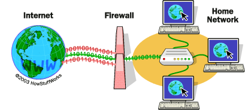

## Firewall

Firewalls are a means of controlling what information is allowed into and out of your local network.In other words, a firewall is a secure and trusted machine that sits between a private network and a public network.

Typically the firewall host is connected to the Internet and your local LAN, and the only access from your LAN to the Internet is through the firewall. This way the firewall can control what passes back and forth from the Internet and your LAN.

Firewalls can be constructed in quite a variety of ways. The most sophisticated arrangement involves a
number of separate machines and is known as a perimeter network. Two machines act as "filters" called
chokes to allow only certain types of network traffic to pass, and between these chokes reside network
servers such as a mail gateway or a World Wide Web proxy server. This configuration can be very safe and
easily allows quite a great range of control over who can connect both from the inside to the outside, and
from the outside to the inside

The Linux kernel provides a range of built−in features that allow it to function quite nicely as an IP firewall.The network implementation includes code to do IP filtering in a number of different ways, and provides a mechanism to quite accurately configure what sort of rules you'd like to put in place.
