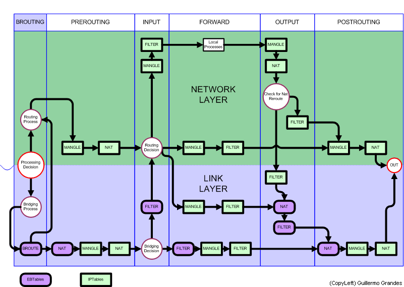

## Introduction to IPtables

`Iptables` is a powerful **firewall integrated into the Linux kernel** itself and part of the netfilter project (consisting of IPtables, ip6tables, ebtables, arptables and ipset). This firewall is fully configurable:
- command line without installing anything on the computer.
- through a Graphical User Interface( there are already several circulating on the network).

`iptables` is a firewall tool that allows not only filter packets, but also perform network address translation (NAT) for IPv4 or maintain log records.
In other words, `iptables` is the name of the user space tool by which administrators can define policies that filter the traffic flowing through the network.

Iptables starts with the system and remains active all the time, adapting and applying to all network traffic rules which have been previously configured.

####Types of tables

There are three types of tables in `iptables`:

######MANGLE tables:
The mangle tables, are responsible for the modification of packets, such as TTL or TOS for example, at the time you specify. It is normally used so far we will not stop in this section. Just tell that to the Kernel 2.4.17 consisted of 2 strings:

 + PREROUTING to modify incoming packets before routing it to the next level Iptables.
 + OUTPUT for altering locally generated packets before routing them.

Since kernel 2.4.18, three new brands were introduced in MANGLE tables:

  + INPUT to modify incoming packets.
  + FORWARD to alter packets that are then routed         through Iptables.
  + POSTROUTING to change packages that are ready to      go.

######NAT table:

The NAT (network address translation or network address translation) tables will be consulted when a packet creates a new connection. Allow share a public IP address among many computers, it is essential in many situations by the shortage of IPv4 addresses. Also allow you to add rules that modify the IP addresses of the packets. It contains two main types of rules, SNAT (or IP masquerading) to change the source address and DNAT (or Port Forwarding) for addresses. Amendment contains three chains:

+ PREROUTING to modify packets as soon get on your PC.
+ OUTPUT for altering locally generated packets before routing them.
+ POSTROUTING to update packages that are ready to leave the team.

######Filtering tables:

Filtering tables are used by default for the handling of data packets. It is responsible for filtering packages such as the string that is set for each of them to a destination or another, or block. All packets pass through this table, which contains three built-in chains:

+ INPUT  with which all packets destined for this system traver sing this chain (and this is called sometimes LOCAL_INPUT),
+ OUTPUT  for all packages created by this system pass through this chain (which is also known as the LOCAL_OUTPUT).
+ FORWARD (REDIRECTION) with all the packages just go through this system to be routed to its destination walking this chain .

Every network packet received by or sent from a Linux system is subject to at least one table. However, a packet may be subjected to multiple rules within each table before emerging at the end of the chain. The structure and purpose of these rules may vary, but usually seek to identify a packet coming from or going to a particular IP address or set of addresses, when using a particular protocol and network service. Regardless of their destination, when packets match a particular rule in one of the tables, are given a goal (target) or share them.

Every chain has a default policy of ACCEPT , DROP , REJECT , or QUEUE. If any of these rules in the chain apply to the packet, then the packet is treated according to the default policy.

####Types Targets

These policies are also known as Targets for the above brands and the most common are:

###### Target ACCEPT

A once the package complies with all the conditions you have specified, if we use the option-j ACCEPT it will be accepted and not travel more rules in the current chain and any other of the same table. This is important because they clarify the package can be removed in another table.

######Target DROP

A once the package complies with all the conditions you have specified, if we use the option-j DROP it will be blocked and will not be processed in any other chain or table.
This can have the drawback leave dead sockets and in many cases should use the REJECT target.

######Target REJECT

This module has the same effect as 'DROP', except that the sender is sent an ICMP error message "port unreachable"

######Target QUEUE

Is used to process packets arriving at a given process, whether accompanied or not addressed to him.

