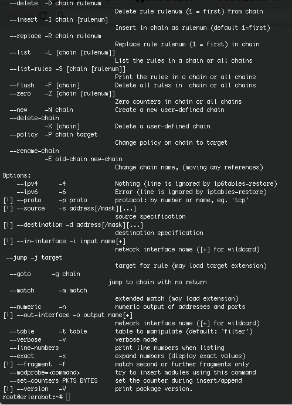
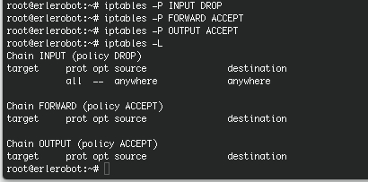

## Orders and parameters


Most common orders are:

|**Order**|**Meaning**|
|-----------|---------------|
|Iptables-F| flush (erase, emptying) of all rules.
|IPtables-L|list of rules that are being implemented.
|Iptables-A| add rule.
|Iptables-D| delete a rule .

Most used parameters are:

|**Parameter**|**Meaning**|
|-----------|---------------|
|-p [protocol] |protocol to which the packet belongs. |
|-s [source]| source address of the packet, can be a hostname, a normal IP address or a network address (mask, so address / mask). |
|-d [destination]| Like the above, it can be a host name, network address, or unique IP address.|
|-i [interface-entry]| Specify the interface on which the packet is received.|
|-o [output-interface] |interface by which to send the packet.|
|[!]-F:| Specifies that the rule refers to second and further fragments of a fragmented packet. If preempts!, Refers only to the first package, or unfragmented packets.|
|-j [target]| Allows you to choose the target to which to send the packet, ie, the action to perform with him. |

For more, you can try typing:
```
iptables --help
```


First you may have in to account that if you get this when you use the command line above, you don't need to type `-t filter` in the following commands:
```
  --table       -t table        table to manipulate (default: `filter')
  ```

To list or consult our firewall rules:
```
iptables -t filter  -L
```


When calling one of the chains, we do this:
```
iptables -t <table> -Action <string>
```


The table is filter, the action can be A,-I,-P or-D (plus other more specific ),  With respect to the chain, we have the choice between -INPUT, -OUTPUT ,- FORDWARD .

example:
```

iptables -t filter -A INPUT
```
To create a basic firewall that blocks incoming connections only, first we build the policies of the three chains of the filter table:
```
iptables -t filter -P INPUT DROP
iptables -t filter -P FORWARD ACCEPT
iptables -t filter -P OUTPUT ACCEPT
```



Now for an example of a rule that accepts connections to port 80 of the system:
```

iptables -A INPUT -i eth0-s 0.0.0.0 / 0-p TCP - dport www-j ACCEPT
```
And here the description of each component of the above command:

- iptables: Iptables command to (do not forget that the rules are a Shell script)
- A: append option to add the rule
- INPUT: package status (to enter is INPUT)
- i eth0: eth0 network interface
- s 0.0.0.0 / 0: address access (either in this case)
- p TCP: port type
- dport: destination port
- j ACCEPT: packet destination (although it is accepted here could be DROP, LOG, REJECT, ..)


For more info you can visit this two websites:

- Iptables man page(http://ipset.netfilter.org/iptables.man.html)
- [Iptables basic guides](http://www.tecmint.com/basic-guide-on-iptables-linux-firewall-tips-commands/)
