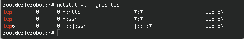

## Secure services and security tips
The goal is to run as few services as possible. If the number of ports that are open for the outside world are kept to a minimum, this is all the better to keep an overview. If services can't be turned off for the local network, try to at least disable them for outside connections.

A rule of thumb is that if you don't recognize a particular service, you probably won't need it anyway. Also keep in mind that some services are not really meant to be used over the Internet. Don't rely on what should be running, check which services are listening on what TCP ports using the netstat command:

```
netstat -l | grep tcp
```


Security Tips:

- xec, rlogin and rsh, and telnet just to be on the safe side.

- X11 on server machines.

- No lp if no printer is physically attached.

- No MS Windows hosts in the network, no Samba required.

- Don't allow FTP unless an FTP server is required.

- Don't allow NFS and NIS over the Internet, disable all related services on a stand-alone installation.

- Don't run an MTA if you're not actually on a mail server.

- Do not allow root logins. UNIX developers came up with the su over two decades ago for extra security.

- Direct root access is always dangerous and susceptible to human errors, be it by allowing root login or by using the `su - `command. Rather than using su, it is even better to use `sudo` to only execute the command that you need extra permissions for, and to return afterwards to your own environment.

    + Note: `sudo` allows a permitted user to execute a command as the superuser or another user, as specified in the sudoers file.

- Take passwords seriously. Use shadow passwords. Change your passwords regularly.

- Try to always use SSH or SSL. Avoid telnet, FTP and E-mail clients and other client programs which send unencrypted passwords over the network. Security is not only about securing your computer, it is also about securing your passwords.

- Limit resources using quota and/or ulimit.

- The mail for root should be delivered to, or at least read by, an actual person.

